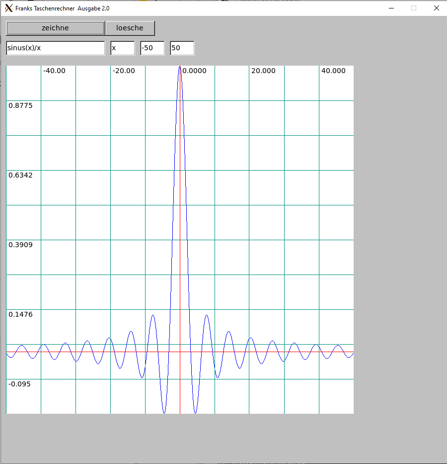
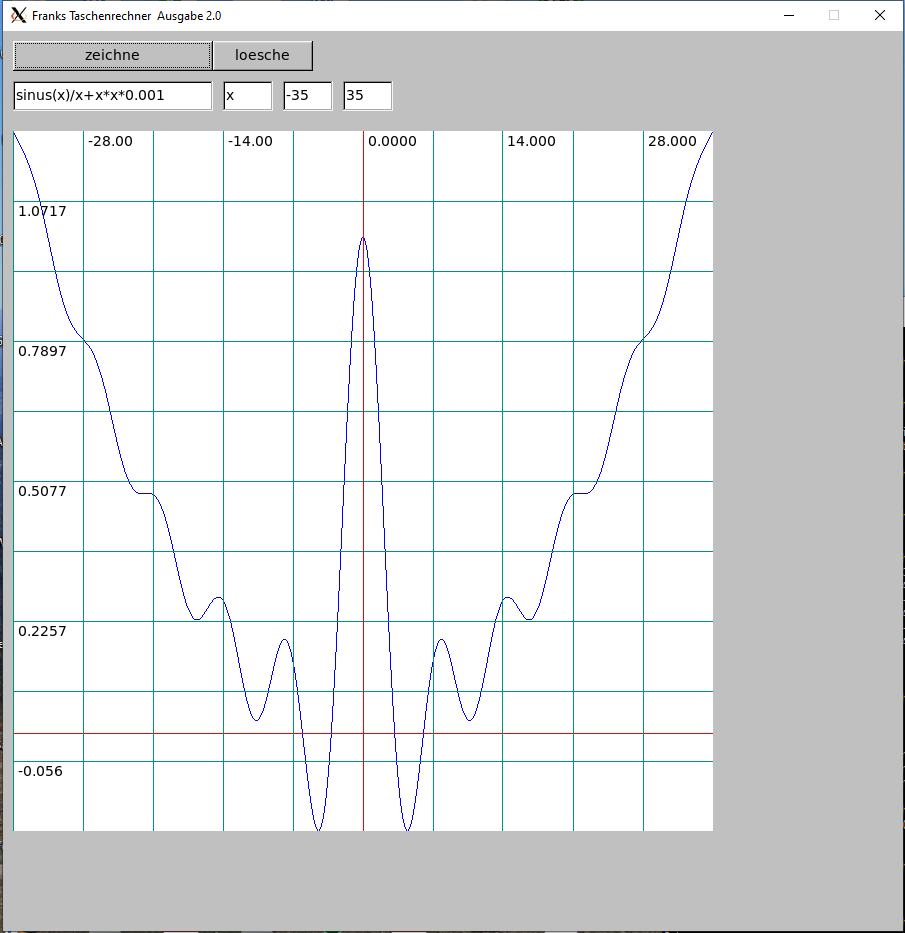

# Grafischer Taschenrechner

Ein grafischer Taschenrechner, welcher direkt symbolische Infix-Ausdrücke wie z.b. "x&ast;x-3&ast;x" auswertet.

Beispielausdrücke sind

x

x&ast;x

x&ast;x&ast;x-2&ast;x&ast;x+10&ast;x-10

exp(2,x)

sinus(x)

sinus(x)/x

2.0&ast;sinus(2.0&ast;3.1415&ast;w)

# Graphical Calculator

A graphical calculator, which directly processes symbolic infix expressions such as "x&ast;x-3&ast;x".

See "Beispielausdrücke" above for sample expressions

# Command Line Mode

The calculator can also run in command line mode, where it simply computes the given expression. 
E.g. compute 2 to the power of 8.5, times 10^44

#Programming Language and System

This program was implemented in the memory safe and efficient language Sappeur (https://sappeur.di-fg.de)
and the fltk GUI library.

\$ output/taschenrechner "exp(2,8.5)&ast;1E+44"

3.6203867196751237e+46

The official Sappeur Home Page: https://sappeur.di-fg.de/

Author: Frank Gerlach

